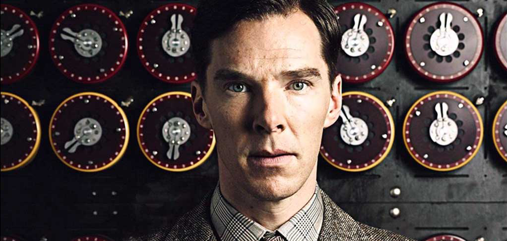

# Enigma Cypher



This repo contains sample code to reproduce the Enigma cyper machine in Python. 

For the sake fo simplicity, it resambles the Enigma M3 model (with 3 rotors), __similar but not equals to__ the one seen in the movie [The imitation game](https://en.wikipedia.org/wiki/The_Imitation_Game).

Here after the machine configurations:

- Rotor 1 wiring I
- Rotor 2 wiring II
- Rotor 3 wiring III
- Each rotor uses the 0 ring setting ("A" ring setting)
- Reflector model UKW-B
- No steckerboard (a.k.a. plugboard) has been implemented, so each letter enters "as it is" into the first rotor.

Wires, rotors and electric contacts have been substituted with circular arrays, variables and counters to encrypt a single letter given a specific rotors position. 

How to run it:

```console
$ python3 enigma.py <input_letter> <rotor_1_counter> <rotor_2_counter> <rotor_3_counter>
```

Rotor counters are a mechanism to shift each rotor by N positions. They can be any integer you want since they are translated to 0 up to 25 (0=a, 25=z).

For example:

```console
$ python3 enigma.py t 1 0 0
Input letter: t
Input letter index: 19
Counter rotor 1: 1
Counter rotor 2: 0
Counter rotor 3: 0
Shift rotor 1: 1
Shift rotor 2: 0
Shift rotor 3: 0
Letter rotor 1: b
Letter rotor 2: a
Letter rotor 3: a
Scrambled letter from rotor 1: a
Scrambled letter from rotor 2: e
Scrambled letter from rotor 3: j
Scrambled letter from reflector: x
Scrambled letter from rotor 3: k
Scrambled letter from rotor 2: d
Scrambled letter from rotor 1: a
Scrambled letter from etw to lamp: z
```

This demo does not implement the automatic rotors increment, since it's just made to reproduce the letter encription with specific rotors position. 

Reference: https://piotte13.github.io/enigma-cipher/
